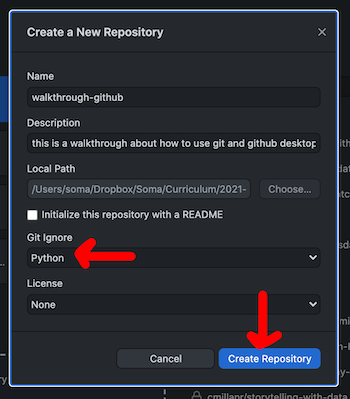
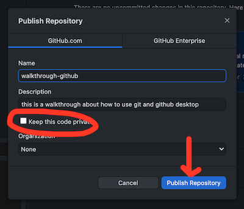

# How to use git + GitHub Desktop

## What and why

`git` is a command-line tool that allows you to create checkpoints - called **commits** - when you're working on coding projects. It's kind of like how Dropbox or Google Docs saves versions of your old work!

Instead of being focused on individual files, with `git` you create collections of files called **repositories**. You can think of a repository as a folder full of files you're keeping track of.

Become we live in a wild and social time, [GitHub](https://github.com/) is a website where you can store or share your repositories. If your repository is public, other people can read your code and even contribute improvements or bug reports!

For example, I made a project called [Tabletop](https://github.com/jsoma/tabletop) ten thousand years ago. It was awful until [another 27 people](https://github.com/jsoma/tabletop/graphs/contributors) helped make improvements to it!

In data journalism, sharing methodology, code and data is an important part of the process for many news organizations. Sharing `git` repositories on GitHub is an excellent way to do that – for example, [BuzzFeed News](https://github.com/BuzzFeedNews/everything) does a great job keeping their analysis reproducible and available.

## With what

While it's very popular and very useful, `git` is an *awful* command-line tool. [You can read people fighting about it here](https://news.ycombinator.com/item?id=12621837). It's hard to use, nothing makes sense, and it's just... it's just not fun.

So instead we'll use [GitHub Desktop](https://desktop.github.com/). It takes care of `git` on your machine, and will also is in charge of sharing your repositories to GitHub. It isn't as powerful as the command-line tool, but it's far easier to use. [Download it](https://desktop.github.com/).

To be able to share your code on GitHub, you'll also need to create [a GitHub account](https://github.com/).

## How

### STEP ONE: Organizing your files

For one repository (aka one project), put all of the files you want to track in a single location. `git` won't be able to keep track of anything if you spread them across multiple directories. For example, you might have a **squirrel-analysis** directory or a **data-homeworks** folder.

Each directory will be turned into a repository that can be shared online.

### STEP THREE: Special files

You don't _need_ these files, but they're nice to have.

#### `README.md`

If you want to write a short document explaining what a repository is, use a `README.md`. This description will automatically show up when someone looks at the repo.

The `.md` stands for Markdown, a way of formatting text without using Docs or Word. Read a [quick Markdown reference here](https://commonmark.org/help/). Right now you're reading a `README.md` written using Markdown!

#### `.gitignore`

The `.gitignore` file is files you want `git` to.... ignore! Maybe you want it to ignore the weird `.DS_Store` files OS X puts everywhere, or a test dataset you were looking at.

I usually go to [gitignore.io](https://gitignore.io/) and get one made for VS Code, Python and OS X.

### STEP FOUR: Creating and publishing your repository

After you're all set for ✨✨everyone in the world✨✨✨ to be able to see your content, we're going to create a **repo**, make a **commit**, and **push everything up to github**.

**GitHub Desktop is kind of tricky about how it creates a repository.** *Do not* try to click "Create a New Repository on your Hard Drive" because I guarantee it won't do what you think.

1. Click **Add an Existing Repository to your Hard Drive**.
2. Click **Create a repository instead**
3. Write a description. You can add a `.gitignore` if you'd like, too.
4. Publish your repository
5. You can choose whether you keep your code private or not

### STEP FIVE: Publishing updates

Every time you want to save a checkpoint, you need to make a **commit**.

When files change in your repo, GitHub Desktop will ask you which changes you want to save (probably all of them!), and ask you to write a short description.

Once you write the description, you can **Commit to main**.

> When you're a wild software developer using git, working on different features for a product, you might have multiple versions of your code (aka branches). We're normal people, though, so we'll just always use the **main** branch.

### STEP SIX: Pushing your changes

Now that you've updated your repo locally (aka saved your changes on your own machine), now you can send the changes over to GitHub.

Use the **Push to origin** button on the top right and [share your code with the world!](https://github.com/jsoma/walkthrough-github)